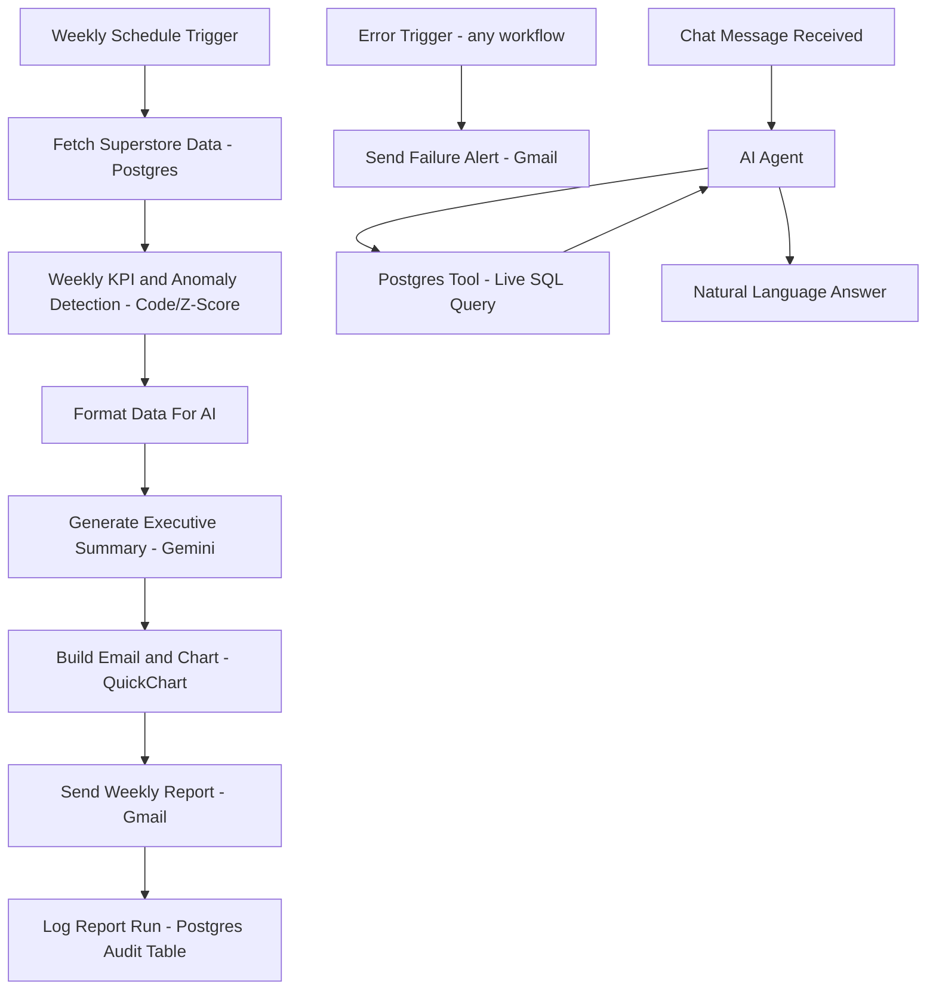

# AI-Powered MIS Reporting & Anomaly Detection Pipeline

An automated weekly business intelligence pipeline that replaces manual MIS reporting with a system that pulls sales data, detects statistically meaningful anomalies, writes an executive summary in plain English, and delivers it by email — plus a companion AI agent that answers ad-hoc questions about the same data in natural language.

## The Business Problem

Most companies have someone manually pulling last week's sales numbers, eyeballing them against "what normal looks like," writing a summary, and emailing leadership — every single week. This project automates that entire judgment call: pull the data, compare this week to real historical performance, flag what's *statistically* unusual (not just "lower than last week"), explain it in plain English, and deliver it — with zero manual effort after setup.

## Architecture

## Tech Stack

- **n8n** (self-hosted via Docker) — workflow orchestration
- **PostgreSQL** (Supabase) — data storage, including 4 years of historical Superstore sales data
- **Google Gemini API** — executive summary generation and natural-language-to-SQL agent
- **QuickChart.io** — dynamic chart image generation
- **Gmail (SMTP)** — report delivery and failure alerts

## How the Anomaly Detection Works

Rather than comparing day-to-day (which is statistically noisy for a small-to-mid-size business), this pipeline aggregates sales by **region, per week**, and compares the current week's total against a **trailing 8-week rolling average** for that region using a **z-score**. Any region whose current week falls more than 2 standard deviations from its own historical baseline gets flagged — a real, defensible statistical method rather than "ask an LLM if this looks weird."

## Natural Language Query Agent

A second, always-on workflow lets you ask plain-English questions about the same sales data — e.g. *"What was the total sales for the West region?"* — and get a live, accurate answer. Built using n8n's AI Agent node with a connected Postgres tool: the agent writes its own SQL query based on the question, executes it against the live database, and responds in natural language.

## Design Decisions

- **Weekly, not daily, cadence** — daily transaction volume is noisy enough to trigger false anomaly alarms; weekly aggregates give a statistically meaningful signal and match how real executive reporting (weekly business reviews) actually works.
- **Self-hosted n8n over n8n Cloud** — free with no execution limits, and demonstrates basic infrastructure management (Docker).
- **Statistical detection (z-score) over a trained ML model** — transparent and explainable for a first version; a trained model (e.g. Isolation Forest) is the natural next iteration once more historical data accumulates.
- **Dedicated error-handling workflow** — failures (API downtime, bad data, connection issues) trigger an alert email instead of failing silently, which most tutorial-level automation projects skip entirely.

## Demo

[Screen recording link — add after recording]

## Author

Jyothi — Data Analyst
